# Chapter 03 產品設計稽核

稽核日期：2026-08-03  
範圍：`LPI_Coach_Chapter03.html` 的桌機、手機與主要互動流程。  
使用者目標：理解「啟發共同願景」、完成案例與自評、選出發展焦點，並帶回工作現場形成行動。

## 整體判斷

頁面已有成熟的編輯感、清楚的章節層級與具體管理案例；課前快問快答、自評結果及發展焦點也能正常運作。主要缺口是學習閉環不完整：首頁承諾「行動後回來做引導式反思」，但實際流程在行動承諾後直接結束。其次是長篇閱讀與十二題自評缺乏持續可見的進度、完成狀態與手機導覽。

## 流程健康度

1. 開始與章節定位 — 良好，但缺少明確「開始學習」主動作。
2. 閱讀前導與概念卡 — 需改善；側欄的「深入閱讀」會跳過三張前置概念卡。
3. 課前情境快問快答 — 良好；原生展開元件、選取狀態及即時回饋都清楚。
4. 深入閱讀 — 需改善；內容完整，但缺少段落進度、續讀位置與章內導覽。
5. 工作案例 — 良好；在地情境、衝突與問題設計清楚。
6. 發展自評 — 需改善；十二題操作長、缺少完成計數，錯誤摘要不在當前視野中。
7. 學習輪廓與焦點 — 良好但可精煉；文字替代資訊充足，但同分時四項全標示為「建議」，沒有真正協助取捨。
8. 工作紀錄 — 需改善；兩個大文字框過於泛化，沒有帶入剛選出的發展焦點。
9. 行動承諾與回訪 — 高風險；焦點有成功帶入，但沒有完成按鈕、回訪提醒或反思步驟。
10. 手機體驗 — 需改善；沒有橫向溢位，但長頁面失去導覽，評分按鈕只有 38×38px。

## 最高影響建議

### 1. 補上「06 行動回顧」，完成首頁承諾的閉環

- 新增行動後回訪區：事實、影響、學習、下一步。
- 在行動承諾加入「完成並安排回訪」主按鈕，日期到期時顯示明確入口。
- 將回顧結果與原始起始提問並排，讓使用者看見前後差異。

### 2. 建立全程可見的進度與完成狀態

- 桌機側欄顯示目前段落、已完成標記與閱讀進度。
- 手機改成可收合的步驟導覽或底部進度列。
- 將三張概念卡移入 `01 深入閱讀` 範圍，避免點選導覽時被跳過。

### 3. 降低自評摩擦並改善可及性

- 顯示「已完成 4/12」並在頂部與送出區同步錯誤摘要。
- 每題使用 `fieldset`／`legend`，讓輔助科技聽到完整題目與分數意義，而不是重複的「1、2、3、4、5」。
- 將手機觸控目標提高到至少 44×44px，替隱藏 radio 的可見圓圈增加清楚的鍵盤焦點樣式。
- 同分時不要把四個焦點都標成「建議」；改用工作情境問題協助選一項。

### 4. 讓「結果 → 紀錄 → 行動」真正串接

- 在工作紀錄頂部持續顯示已選焦點與建議行為。
- 將兩個泛用文字框改為：情境、觀察證據、下一次行為。
- 行動承諾欄位加上可見且可存取的標籤：要做什麼、何時、在哪個場景、如何判斷有效。

### 5. 提前處理隱私與低對比風險

- 將「人物與事件去識別化」提示移到第一個文字輸入區附近，不要只放在頁尾。
- 小字使用的 sage `#6f8f7b` 對 paper 約 3.44:1、gold `#d49b52` 對 paper 約 2.36:1；若用於一般小字需加深。這是程式色值檢查，不等同完整 WCAG 驗證。

## 已確認的優點

- 桌機版的側欄、主內容寬度與留白穩定，閱讀感具有明確的編輯風格。
- 使用 `main`、`aside`、標題層級與原生 `details`，語意基礎良好。
- 快問快答使用 `aria-pressed` 與即時回饋；未完成自評會標出缺漏題目。
- 結果除了雷達圖，仍提供文字摘要、數值與長條資訊，不只依賴 canvas。
- 手機版未出現橫向溢位，文字、案例卡與評分列能正常重排。
- 本機儲存限制說明清楚；本次互動未發現 console error 或 warning。

## 證據限制

本次以 1280×720 桌機與 390×844 手機畫面、DOM 狀態及主要互動完成檢查。尚未進行真實螢幕閱讀器、完整鍵盤巡覽、200%／400% 縮放、不同瀏覽器或正式 WCAG 合規測試，因此可及性結論應視為風險清單，而非合規聲明。

## 畫面證據

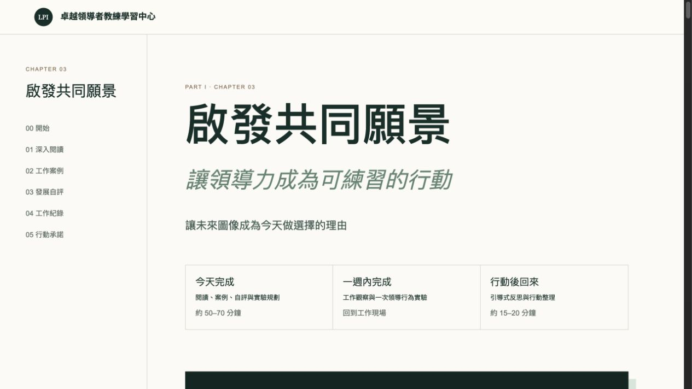

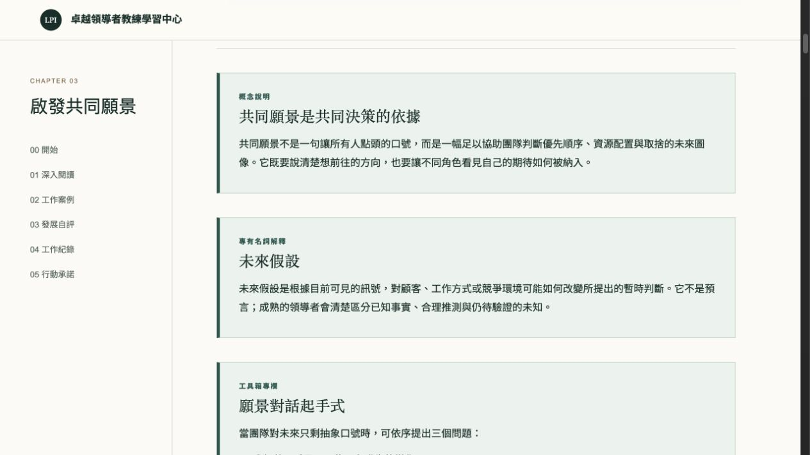

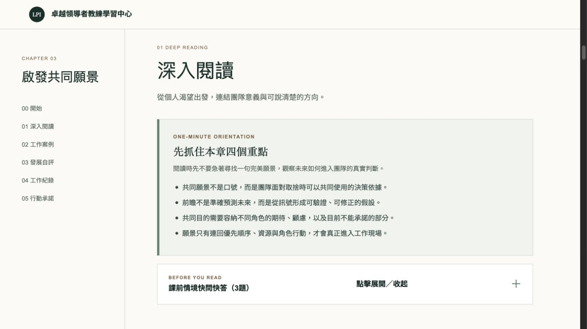

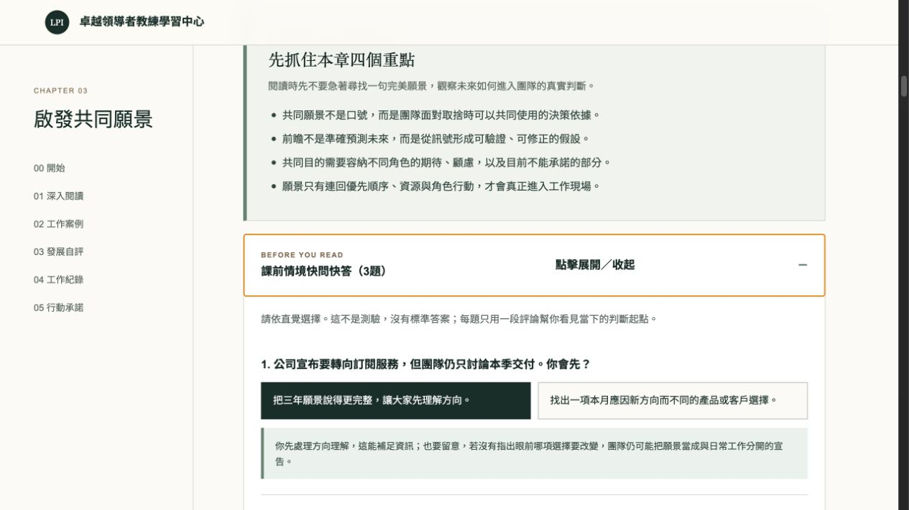

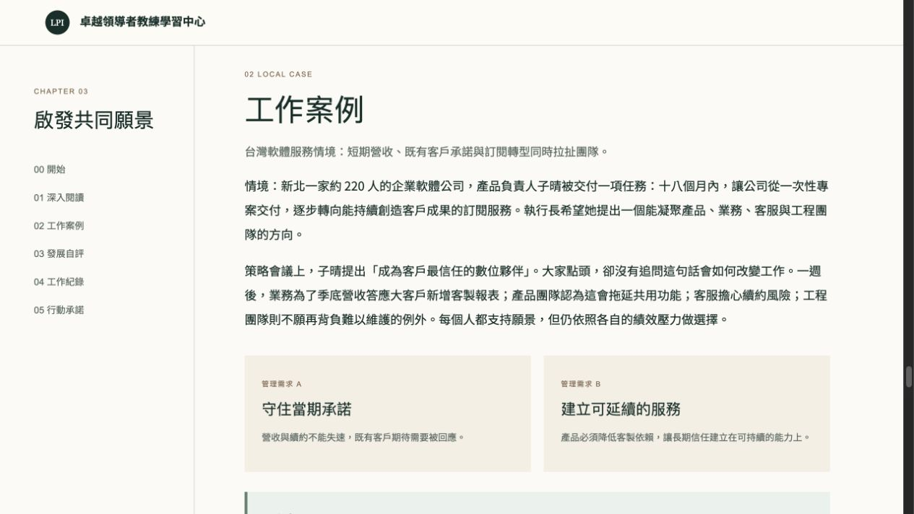

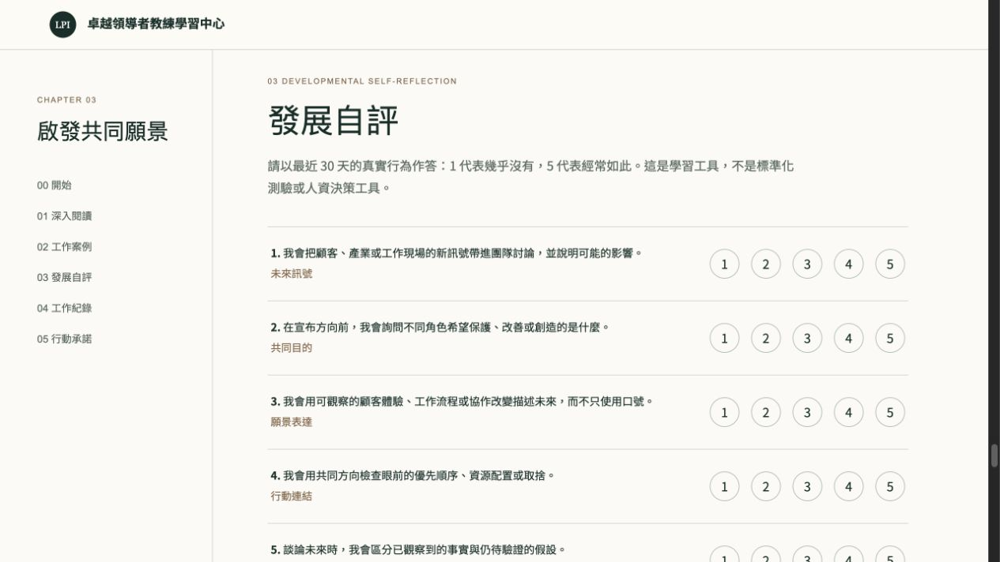

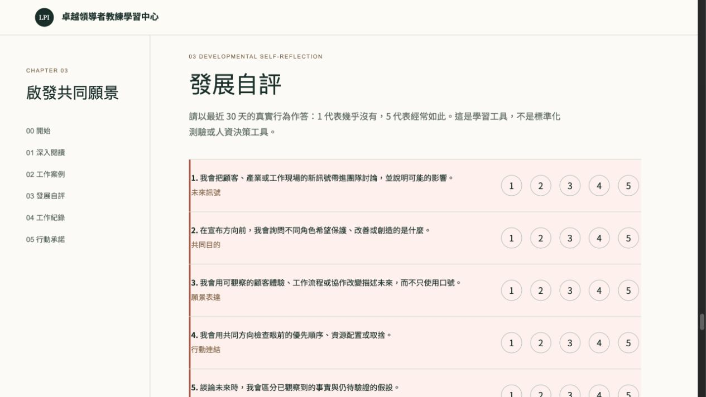

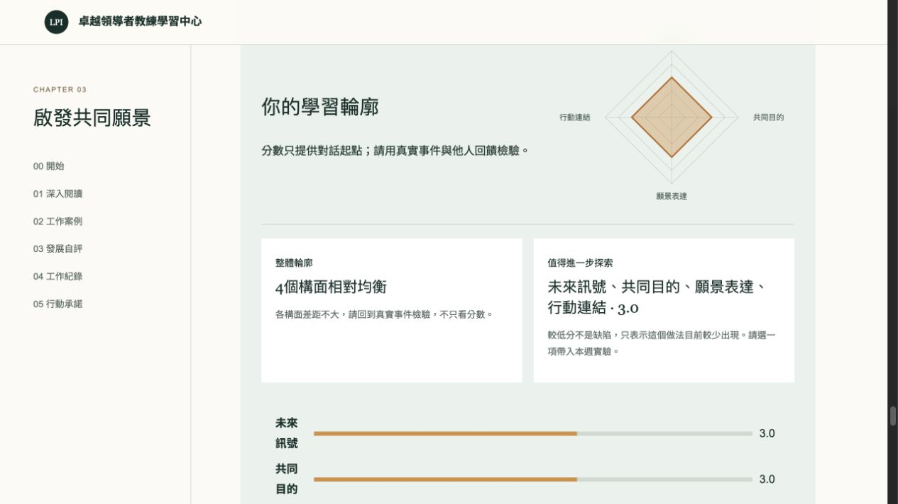

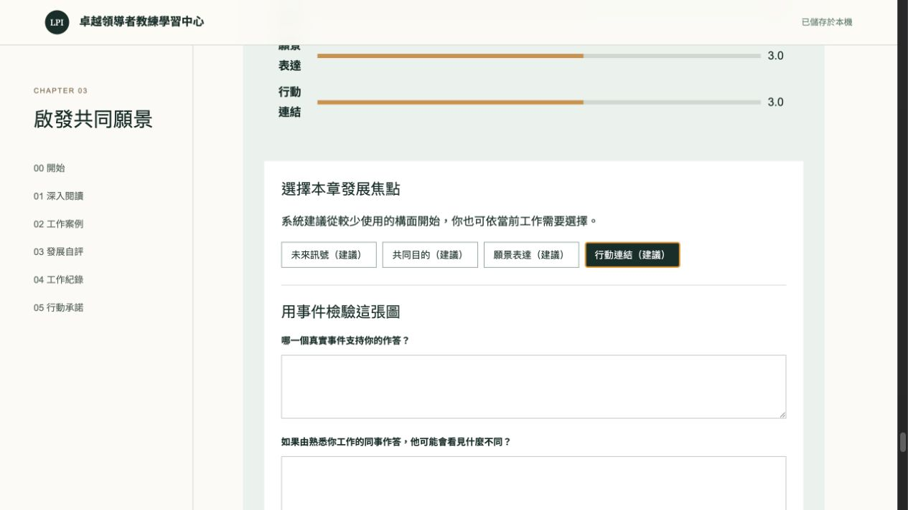

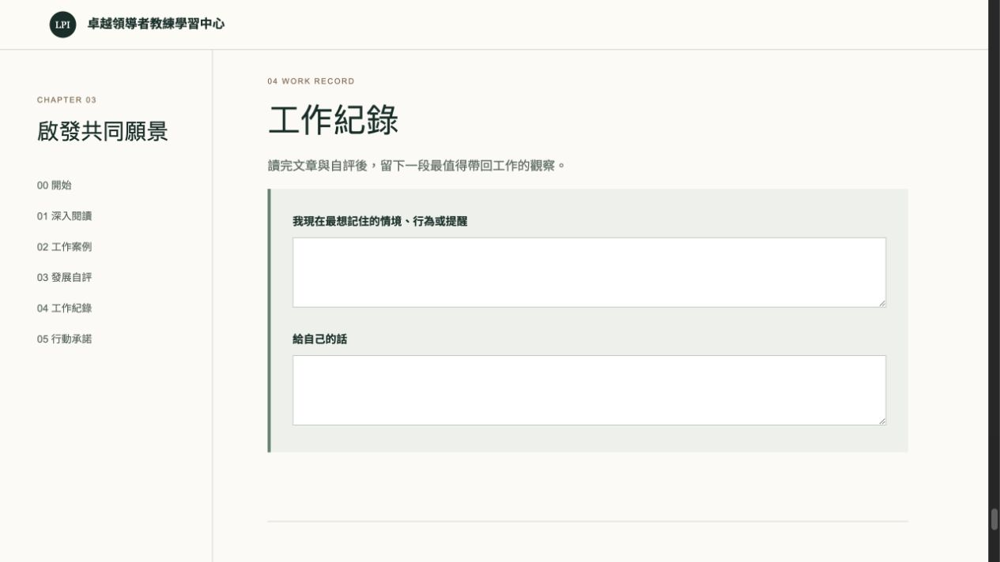

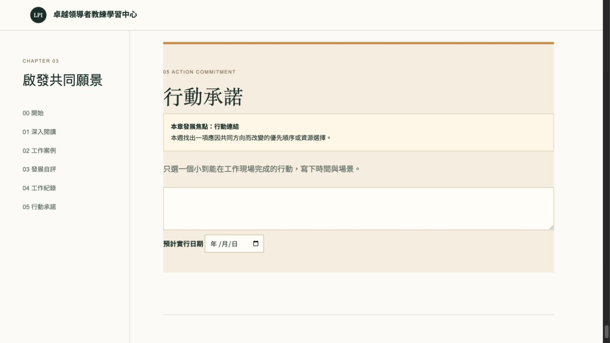

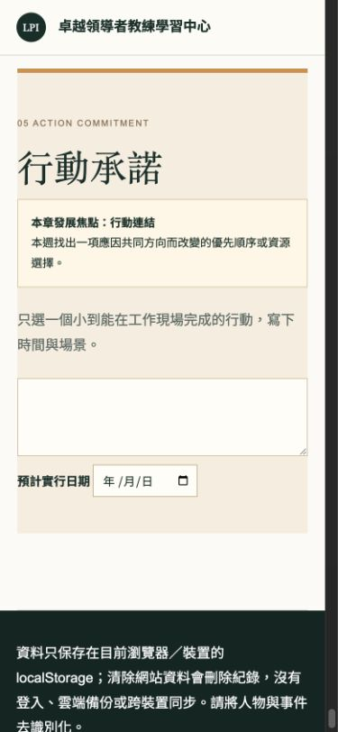

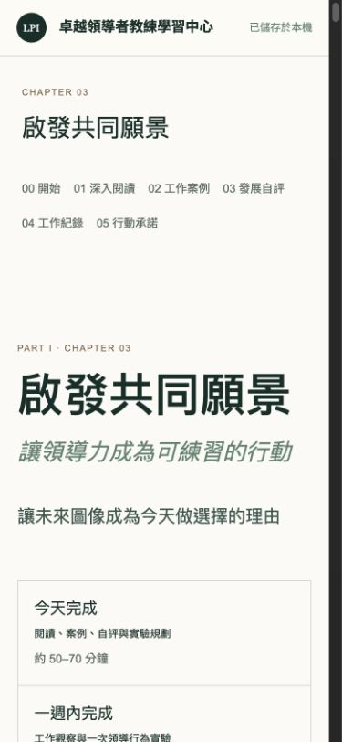

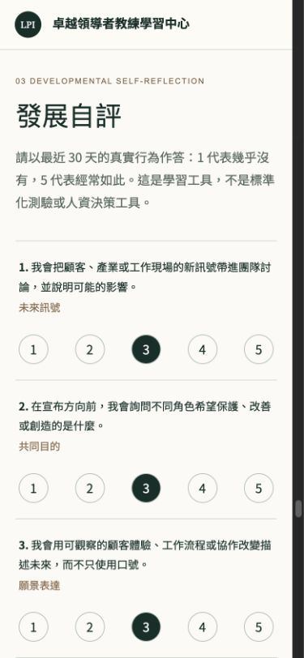
